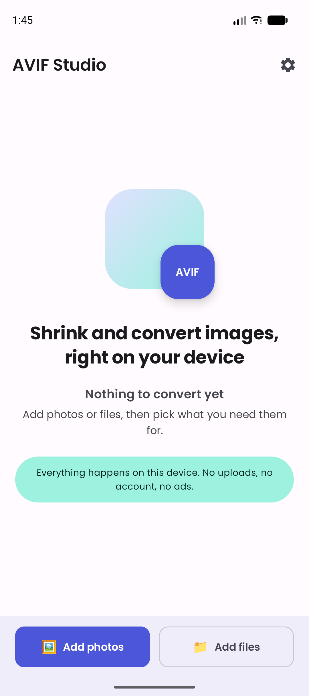
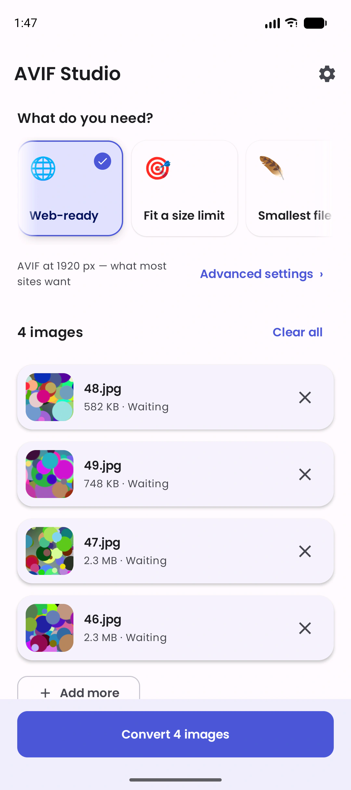
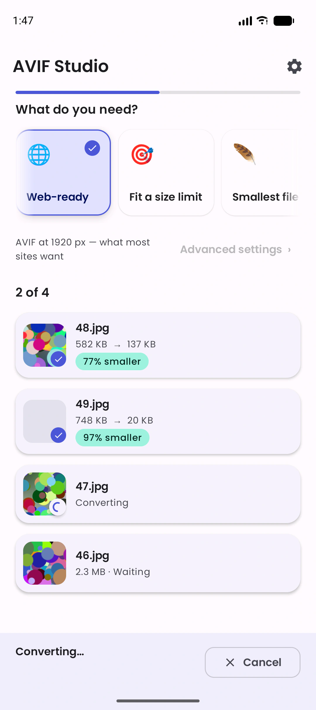
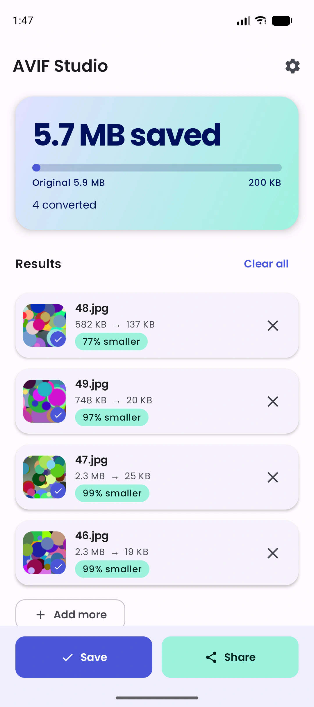
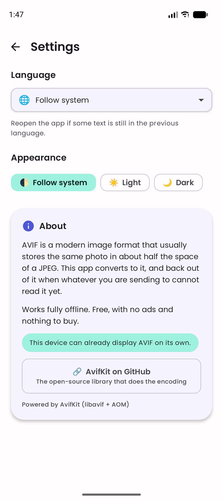
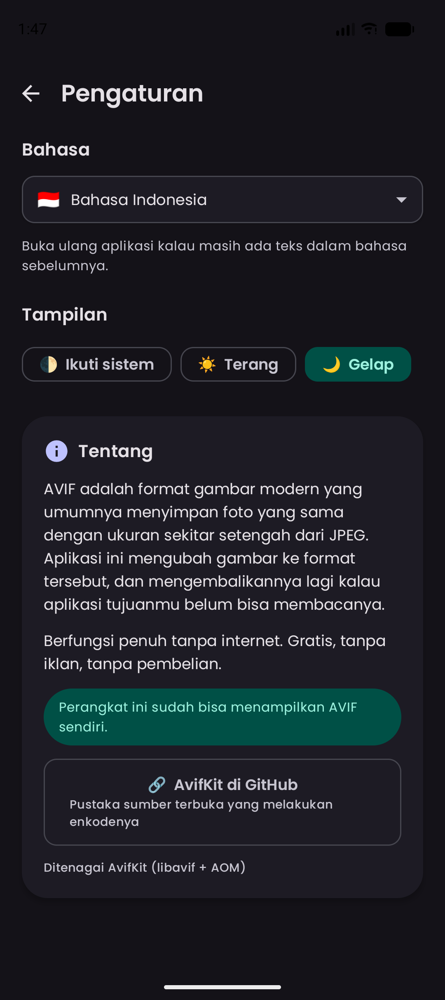
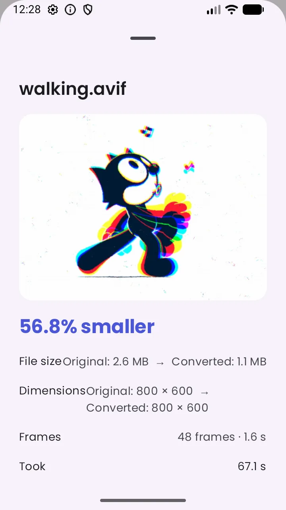
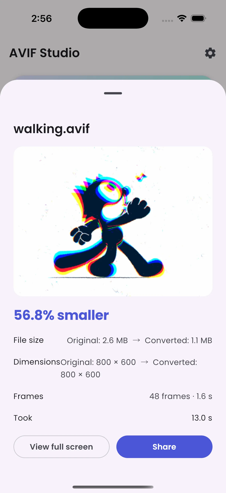
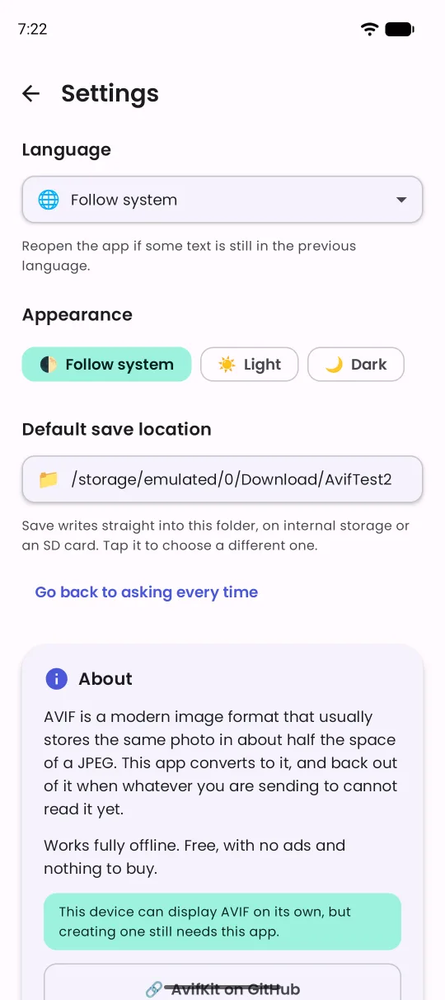
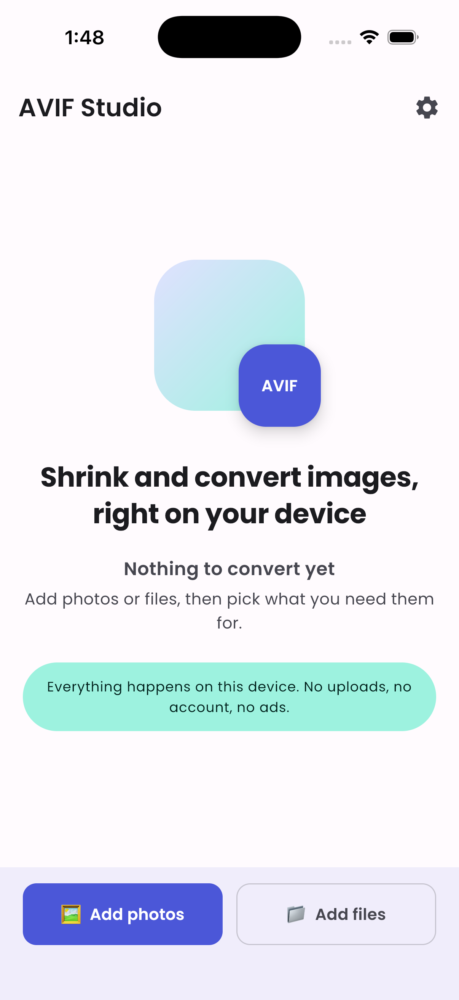

This is a Kotlin Multiplatform project targeting Android and iOS, built with **Android Gradle
Plugin 9.2** (requires Gradle 9.4.1+ and JDK 17+).

* [/shared](shared/src) — the AvifKit library itself. The cross-platform API lives in
  [commonMain](shared/src/commonMain/kotlin); platform code is in `androidMain` (Kotlin JNI
  bindings) and `iosMain` (Kotlin/Native cinterop straight to libavif's C API — no Swift).
  Published to Maven Central as
  `io.github.alfikri-rizky:avifkit`. Uses the AGP 9 KMP library plugin
  (`com.android.kotlin.multiplatform.library`).

* [/shared-native](shared-native/src) — the Android native build (libavif/AOM + JNI wrapper),
  compiled with CMake/NDK. It's a plain `com.android.library` because the KMP library plugin
  can't build native code. Published as the companion artifact `avifkit-native`, which `:shared`
  pulls in transitively — so consumers only ever depend on `avifkit`.

* [/composeApp](composeApp/src) — **AVIF Studio**, the shared Compose Multiplatform UI for the
  Android and iOS apps. A KMP *library* module (AGP 9 forbids the KMP plugin alongside
  `com.android.application` in one module), producing the `ComposeApp` framework for iOS.
  Not published.

* [/androidApp](androidApp/src) — the Android application shell: one Activity, a manifest and
  launcher resources. Everything the user sees comes from `:composeApp`. Not published.

* [/iosApp](iosApp/iosApp) — the iOS application shell: a SwiftUI `@main` that hosts
  `MainViewController()` from the `ComposeApp` framework. Not published.

---

## AVIF Studio (the app)

A free, offline image converter built on AvifKit — the reference app for the library, and a real
app in its own right. No ads, no accounts, no network permission.

* **Batch convert** photos to AVIF, or back out of AVIF to JPEG/PNG when the other end cannot read
  it (Android 11 and below cannot display AVIF at all).
* **Job-shaped presets** — "Web-ready", "Fit a size limit", "Smallest file", "Archive quality" —
  rather than a wall of codec settings, with every knob still available under Advanced settings.
* **Animated GIFs stay animated.** A GIF converts to an AVIF image sequence — every frame, its own
  delay, the same loop count — and the result plays back in the app's preview. Byte budgets do not
  apply here: an animation is kept whole rather than trimmed to a size target.
* **Fit a byte budget** using AvifKit's adaptive compression (100 KB … 2 MB, SMART or STRICT).
* **One image at a time**, gated by a single-permit semaphore. Twenty 12 MP photos decoded
  concurrently is an OOM on a mid-range phone; this caps peak memory at one in-flight image no
  matter how many callers arrive at once.
* **Keeps the original** when the conversion came out no smaller, instead of quietly handing back
  a bigger file.
* **Pick a default save location** (Android) and Save writes straight into it — internal storage or
  an SD card — instead of asking for a destination on every batch. Powered by
  [SimpleStorage](https://github.com/anggrayudi/SimpleStorage) 3.x, which is also why the app needs
  Android 8.0. iOS still asks every time; its export sheet has no folder to remember.
* **English and Bahasa Indonesia**, light/dark/system theme, both persisted in DataStore along with
  the last preset used.
* **Share to** and **Open with** integration on both platforms, so an `.avif` from a browser
  download opens here.

Run it with `./gradlew :androidApp:installDebug`, or open `iosApp/iosApp.xcodeproj` in Xcode.
Both build the same UI from `:composeApp`.

| Home | Pick a recipe | Converting |
|---|---|---|
|  |  |  |

| Results | Settings | Bahasa Indonesia + dark |
|---|---|---|
|  |  |  |

An animated GIF keeps all 48 of its frames, and the preview plays them — same result on both
platforms, from the same shared code:

| Android | iOS |
|---|---|
|  |  |

Picking a folder once, so Save stops asking:



The same Compose UI on iOS, from the same `:composeApp` module:



### Build and Run Android Application

To build and run the development version of the Android app, use the run configuration from the run widget
in your IDE’s toolbar or build it directly from the terminal:
- on macOS/Linux
  ```shell
  ./gradlew :androidApp:assembleDebug
  ```
- on Windows
  ```shell
  .\gradlew.bat :androidApp:assembleDebug
  ```

### Build and Run iOS Application

To build and run the development version of the iOS app, use the run configuration from the run widget
in your IDE’s toolbar or open the [/iosApp](iosApp) directory in Xcode and run it from there.

---

## AvifKit Library

AvifKit is a production-ready Kotlin Multiplatform library for AVIF image encoding and decoding on Android and iOS.

### Features

#### Core Functionality
- ✅ **AVIF Encoding & Decoding** - Full support via libavif + AOM on both platforms (cinterop on iOS, JNI on Android)
- ✅ **Animated GIF → animated AVIF** - Frames, per-frame delays and loop count preserved as an AVIF image sequence, streamed one frame at a time so memory stays flat
- ✅ **Android 15+ Compatible** - 16 KB page size alignment (Google Play requirement)
- ✅ **Adaptive Compression** - Intelligent file size targeting with two strategies
- ✅ **Priority Presets** - Quick configuration for common use cases
- ✅ **Multi-threaded Processing** - Parallel encoding/decoding with auto-tiling across all CPU cores
- ✅ **Format Detection** - Automatic image format identification
- ✅ **Orientation Support** - EXIF orientation handling on Android, UIImage orientation on iOS
- ✅ **Auto-Registration (iOS)** - Native handler registers automatically via `__attribute__((constructor))` — no manual setup needed
- ✅ **Swift Error Handling** - `@Throws` annotations propagate errors as `NSError` to Swift's `do/catch`
- ✅ **Explicit Error Reporting** - Clear `AvifError` exceptions when dependencies are missing (no silent fallbacks)
- ✅ **Memory Safety** - OutOfMemory error handling

#### Advanced Features
- Animated GIF input, and `decodeAvifFrames` to read an image sequence back frame by frame
- Image resizing with dimension constraints
- Chroma subsampling options (YUV444, YUV422, YUV420)
- Alpha channel quality control
- Metadata preservation (optional)
- Multiple input types (ByteArray, Bitmap/UIImage, file path)

### Architecture

AvifKit uses **native AVIF libraries** on both platforms with explicit error reporting:

- **Android:** libavif (v1.4.2) + AOM via JNI — pre-built native binaries included in the AAR
- **iOS:** the same libavif + AOM, linked directly into the Kotlin/Native framework via cinterop — the `Shared` XCFramework is self-contained (no avif.swift, no Swift bridge, no registration step). See [docs/IOS_CINTEROP_SOLUTION.md](docs/IOS_CINTEROP_SOLUTION.md).
- **Error Handling:** clear `AvifError` exceptions are thrown on failure (no silent fallbacks)

### Usage

#### Basic Conversion

```kotlin
val converter = AvifConverter()

// Convert to AVIF with priority preset
val result = converter.convertToFile(
    input = ImageInput.from("/path/to/image.jpg"),
    outputPath = "/path/to/output.avif",
    priority = Priority.BALANCED
)
```

#### Animated GIFs

An animated GIF becomes an AVIF image sequence automatically — no extra call, no flag to remember.
Frames, per-frame delays and the loop count all survive.

```kotlin
val converter = AvifConverter()

val avif = converter.encodeAvif(ImageInput.from(gifBytes))

val info = converter.getImageInfo(ImageInput.from(avif))
info.isAnimated      // true
info.frameCount      // 48
info.durationMillis  // 1610
info.loopCount       // 0 — loops forever, as the GIF did

// Reading a sequence back. Both limits are memory bounds: every frame is held at once.
val frames = converter.decodeAvifFrames(
    input = ImageInput.from(avif),
    maxDimension = 480,
    maxFrames = 120,
)
frames.first().durationMillis  // 30
```

Set `EncodingOptions(encodeAnimation = false)` to keep only the first frame instead. `maxSize` does
not apply to animated output: reaching a byte budget by dropping frames would change what the image
is, so the animation is kept whole and `quality`/`maxDimension` are the knobs. A still image is a
one-frame sequence, so `decodeAvifFrames` never needs a branch in front of it.

#### Advanced Compression with Target Size

When you need to compress images to meet a specific file size limit, AvifKit offers two compression strategies:

##### SMART Compression (Recommended)

Finds the **highest quality** image that still meets your target file size. This is the default and recommended strategy for most use cases.

```kotlin
val options = EncodingOptions(
    maxSize = 200 * 1024, // 200KB target
    compressionStrategy = CompressionStrategy.SMART  // Default
)

val result = converter.convertToFile(
    input = ImageInput.from("/path/to/image.jpg"),
    outputPath = "/path/to/output.avif",
    priority = Priority.BALANCED,
    options = options
)
```

**How it works:**
- Uses binary search to find optimal quality setting
- Typically completes in 6-8 attempts
- If target is 200KB, it might produce a 198KB image at quality 85
- Faster and produces better-looking results

**Best for:**
- General image compression
- User-facing images where quality matters
- Web optimization with size constraints
- Profile pictures, thumbnails with size limits

##### STRICT Compression (Maximum Compression)

Finds the **smallest possible** image by continuing compression even after meeting the target size.

```kotlin
val options = EncodingOptions(
    maxSize = 200 * 1024, // 200KB target
    compressionStrategy = CompressionStrategy.STRICT
)

val result = converter.convertToFile(
    input = ImageInput.from("/path/to/image.jpg"),
    outputPath = "/path/to/output.avif",
    priority = Priority.BALANCED,
    options = options
)
```

**How it works:**
- Tries multiple compression levels progressively
- Continues even after meeting target to maximize compression
- May take up to 10 attempts
- If target is 200KB, might compress down to 120KB

**Best for:**
- Storage-critical scenarios
- Batch processing where smallest size matters
- Archival systems
- Applications with strict storage quotas

#### Comparison: SMART vs STRICT

| Aspect | SMART | STRICT |
|--------|-------|--------|
| Goal | Best quality within limit | Smallest possible size |
| Speed | Faster (6-8 attempts) | Slower (up to 10 attempts) |
| Result Quality | Higher quality | Lower quality |
| Result Size | Near target size | Well below target |
| Use Case | General use | Storage-critical |

Example with 500KB target:
- **SMART**: Produces 495KB at quality 88
- **STRICT**: Produces 320KB at quality 62

### Priority Presets

```kotlin
Priority.SPEED    // Fast encoding, lower quality
Priority.QUALITY  // Best quality, slower encoding
Priority.STORAGE  // Minimum file size
Priority.BALANCED // Good balance (default)
```

### Encoding Options

```kotlin
EncodingOptions(
    quality = 75,                                    // Base quality (0-100)
    speed = 6,                                       // Encoding speed (0-10)
    subsample = ChromaSubsample.YUV420,             // Chroma subsampling
    alphaQuality = 90,                              // Alpha channel quality
    maxDimension = 2048,                            // Auto-resize if larger
    maxSize = 200 * 1024,                           // Target size in bytes
    compressionStrategy = CompressionStrategy.SMART, // SMART or STRICT
    encodeAnimation = true                          // Keep animated GIF input animated
)
```

### Installation

AvifKit is published as a Kotlin Multiplatform library with seamless integration for both Android and iOS platforms.

> **Toolchain:** built with Kotlin 2.3.21, so the klibs carry ABI version 2.3.0 — KMP consumers
> need Kotlin 2.3 or newer. Android bytecode targets Java 11.

> **Pick ONE iOS channel — do not mix.**
> - **KMP / Compose Multiplatform apps → Gradle only.** Add the `commonMain`
>   Gradle dependency below. The iOS AVIF codec (libavif + AOM) is embedded in the
>   Kotlin/Native artifact, so iOS links with no SPM package and no extra setup —
>   exactly like Android. This is the recommended path for shared KMP code.
> - **Pure SwiftUI / iOS-only apps → SPM** (`import Shared`; see iOS section).
> - **Never add both Gradle *and* SPM in the same project.** That links two
>   separate copies of the `Shared` module into two different frameworks with
>   disjoint symbol namespaces, which fails with `Undefined symbol: _avif*` at
>   link time. If your app uses the shared KMP module via Gradle, remove the SPM
>   `AvifKit` package reference from the iOS app target.

#### Android (Gradle)

Add the dependency to your `build.gradle.kts`:

```kotlin
dependencies {
    implementation("io.github.alfikri-rizky:avifkit:0.3.2")
}
```

**That's it!** The library includes pre-built native binaries for all ABIs (arm64-v8a, armeabi-v7a, x86, x86_64) with full AVIF support via libavif.

#### iOS (Swift Package Manager) - Recommended ⭐

**In Xcode:**
1. File → Add Packages...
2. Enter repository URL: `https://github.com/alfikri-rizky/AvifKit`
3. Select version: `0.3.2` or higher
4. **Important:** After adding the package, **clean build folder** (Cmd+Shift+K) before first build

**Or add to your `Package.swift`:**

```swift
dependencies: [
    .package(url: "https://github.com/alfikri-rizky/AvifKit", from: "0.3.2")
]
```

**Setup Notes:**
- ✅ SPM downloads a single, self-contained pre-built XCFramework from GitHub Releases (the AVIF codec is linked in via cinterop — no extra dependency, no source compilation)
- ✅ No registration code needed — `import Shared` and use `AvifConverter()` directly
- ⚠️ **First-time setup:** the XCFramework may take a moment to download on first resolve
- ⚠️ **Important:** Always do a clean build (Product → Clean Build Folder) after adding the package

**Usage:**

```swift
import Shared

let converter = AvifConverter()
print("AVIF available:", converter.isAvifSupported())  // true
```

**Troubleshooting:**

1. **Clean caches** if resolution misbehaves:
   ```bash
   rm -rf ~/Library/Caches/org.swift.swiftpm ~/Library/org.swift.swiftpm
   rm -rf ~/Library/Developer/Xcode/DerivedData
   ```
2. **In Xcode:** File → Packages → Reset Package Caches; Product → Clean Build Folder (Cmd+Shift+K); Build.

**Download from GitHub Releases:** [v0.3.2](https://github.com/alfikri-rizky/AvifKit/releases/tag/v0.3.2)

#### iOS (CocoaPods) - Not Recommended ⚠️

CocoaPods support is technically available but **not recommended** due to validation issues:

```ruby
pod 'AvifKit', '~> 0.3.2'
```

**Important Notes:**
- CocoaPods validation may fail due to transitive dependency configuration issues
- **However, actual usage works fine** when users install via `pod install` since app deployment targets (iOS 15.0+) override pod settings
- Our code and XCFramework are fully compatible

**Recommended alternatives:**
1. **Swift Package Manager** (fully supported, recommended)
2. **Direct XCFramework** from [GitHub Releases](https://github.com/alfikri-rizky/AvifKit/releases/latest)

---

### Platform Implementation Details

#### Android
- **Native C++ implementation** via JNI (`shared-native/src/main/cpp/`, the `:shared-native` module)
- **Pre-built libavif binaries** included for all ABIs
- **EXIF orientation support** (preserves portrait/landscape orientation)
- **Multi-threaded encoding/decoding** with auto-tiling (uses all CPU cores)
- **Explicit errors** when native library is missing (no silent JPEG fallback)

**Technical Details:**
- NDK with CMake build system
- Conditional compilation support
- Optimized with `-O3` compiler flags
- Symbol stripping for smaller binary size

#### iOS
- **Direct libavif binding** via Kotlin/Native cinterop (`AvifConverter.ios.kt` → `libavif`) — the same C API as Android, no Swift bridge
- **libavif v1.4.2 + AOM** statically linked into `Shared.framework` (self-contained XCFramework)
- **UIImage ⇄ RGBA via CoreGraphics** — orientation handled by drawing through a bitmap context
- **No registration step** — the codec is always present (`isAvifSupported()` returns `true`)
- **`@Throws` annotations** — errors propagate as NSError to Swift's do/catch
- **Explicit errors** on failure (no silent JPEG fallback)

**Technical Details:**
- iOS 15.0+ deployment target
- libavif v1.4.2 + aom v3.14.1 (encode + decode)
- Codec static libs built by `scripts/build-ios-libavif.sh`; linked via cinterop `linkerOpts`
- XCFramework support for iosArm64 / iosSimulatorArm64 / iosX64

### Implementation Status

| Component | Status | Location | Notes |
|-----------|--------|----------|-------|
| **Core Library** | ✅ Complete | `shared/src/commonMain/` | Cross-platform API |
| **Android Native** | ✅ Complete | `shared-native/src/main/cpp/` | JNI + libavif (`:shared-native` module) |
| **iOS Native** | ✅ Complete | `shared/src/iosMain/kotlin/` + `shared/src/nativeInterop/` | cinterop + libavif (no Swift) |
| **Adaptive Compression** | ✅ Complete | Both platforms | SMART & STRICT strategies |
| **Orientation Support** | ✅ Complete | Both platforms | EXIF (Android), UIImage (iOS) |
| **Fallback Mode** | ❌ Removed | Both platforms | Replaced with explicit `AvifError` exceptions |
| **Distribution** | ✅ Complete | `Package.swift` | SPM support (CocoaPods coming soon) |
| **Build Configuration** | ✅ Complete | `shared/build.gradle.kts` | Ready for publishing |

### Known Limitations

1. **Library Size:**
   - Including libavif increases app size (~2-3MB per architecture on Android, ~1-2MB on iOS)
   - This is standard for any AVIF library and necessary for native performance
   - There is no smaller build to fall back to: the codec is the library

2. **No Fallback Mode (v0.2.3+):**
   - Library no longer silently falls back to JPEG
   - Missing dependencies throw clear `AvifError` exceptions
   - Ensures consumers are aware of configuration issues

3. **Platform API Differences:**
   - Android uses `android.graphics.Bitmap`
   - iOS uses `UIImage`
   - Abstracted via `PlatformBitmap` expect/actual pattern

4. **Build Requirements (for library authors only):**
   - Android: Requires NDK and CMake to build from source
   - iOS: Requires Xcode and CocoaPods/SPM
   - End users don't need these - they get pre-built binaries

### Verifying Setup

Check if native AVIF is available:

```kotlin
val converter = AvifConverter()
val isSupported = converter.isAvifSupported() // true on both platforms (codec statically linked)
```

### Testing Fallback Behavior

The library automatically uses fallback when native library is unavailable:

- **Encoding/Decoding:** Throws `AvifError.EncodingFailed` or `AvifError.DecodingFailed` with actionable error messages
- **Swift (iOS):** Errors propagate as `NSError` via `@Throws` — caught by Swift's `do/catch`
- **Android:** Errors thrown as standard Kotlin exceptions

---

### For Library Authors & Contributors

If you want to build the library from source or contribute to development:

#### Prerequisites
- **Android:** NDK, CMake 3.18.1+
- **iOS:** Xcode (verified on 26.1), CocoaPods or SPM
- **Both:** JDK 17 — what CI builds on. Kotlin comes from the version catalog, so there is nothing
  to install separately.

> **Do not pair a new Xcode with an old Kotlin.** cinterop is generated from the SDK headers you
> have installed, while `platform.*` klibs ship prebuilt inside the Kotlin/Native distribution. If
> Xcode is newer than the SDK that distribution was built against, cinterop references types those
> klibs do not contain and `commonizeCInterop` dies on `Unresolved classifier: platform/...`. Xcode
> 26 needs Kotlin 2.2.21 or newer for this reason.

#### Setup Development Environment

```bash
# 1. Clone the repository
git clone https://github.com/alfikri-rizky/AvifKit.git
cd AvifKit

# 2. Run the preparation script (downloads libavif, builds everything)
./scripts/prepare-for-publish.sh

# 3. Build the project
./gradlew :shared:build
```

#### Publishing

The library uses a comprehensive publishing setup:

**To Maven Central** (publishes the library and its native companion — both required):
```bash
./gradlew :shared-native:publishToMavenCentral :shared:publishToMavenCentral
```

**To local Maven (for testing):**
```bash
./gradlew :shared-native:publishToMavenLocal :shared:publishToMavenLocal
```

**To CocoaPods:**
```bash
pod trunk push AvifKit.podspec
```

#### Scripts Reference

- `scripts/setup-android-libavif.sh` - Downloads libavif for Android development
- `scripts/setup-ios-avif.sh` - Sets up iOS dependencies (CocoaPods/SPM)
- `scripts/prepare-for-publish.sh` - Prepares everything for release (runs both setup scripts + builds)
- `scripts/verify-integration.sh` - Verifies the integration is working correctly

**Note:** End users of your published library don't need these scripts - they're only for development and publishing.

---

### Changelog

Release notes for every version live on the [Releases page](https://github.com/alfikri-rizky/AvifKit/releases).

---

Learn more about [Kotlin Multiplatform](https://www.jetbrains.com/help/kotlin-multiplatform-dev/get-started.html)…
